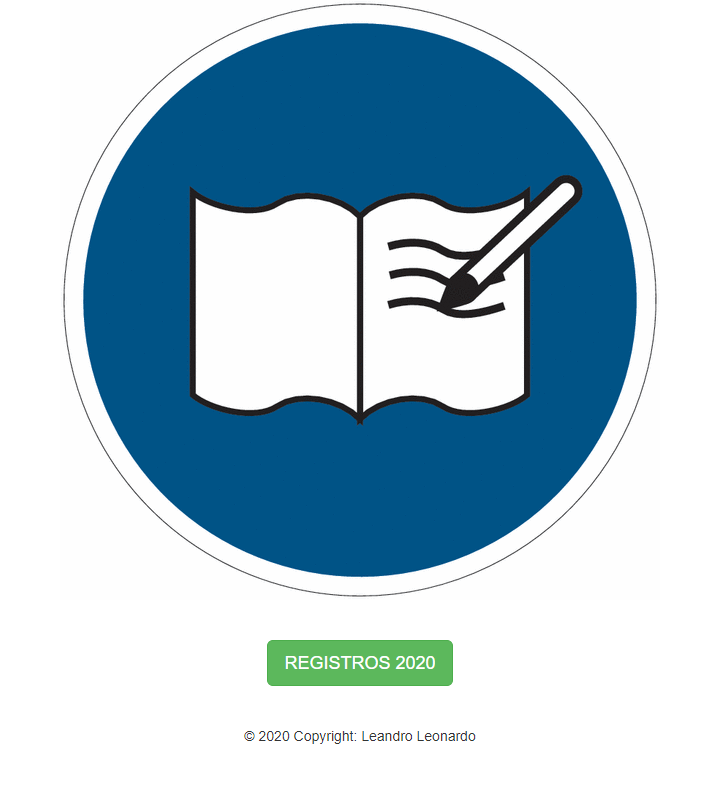
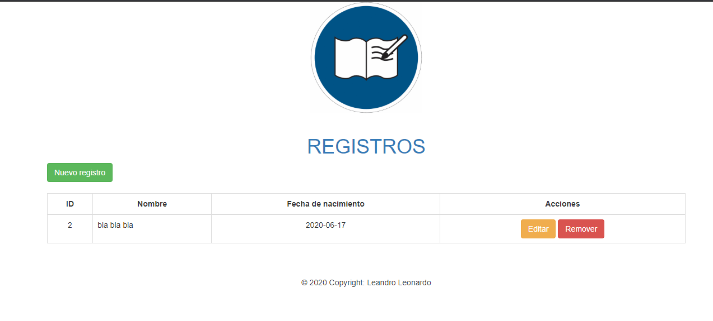
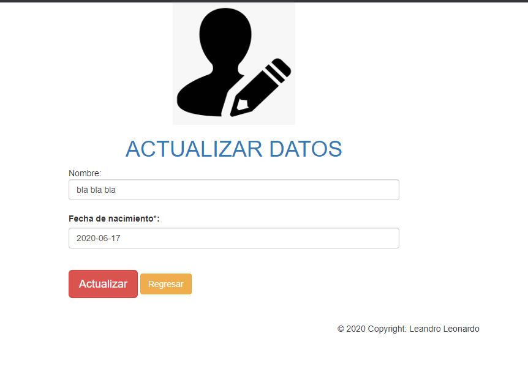
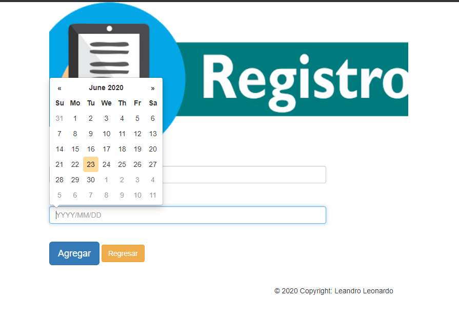
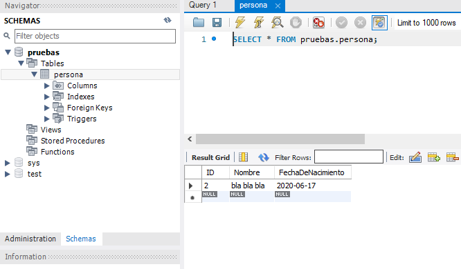
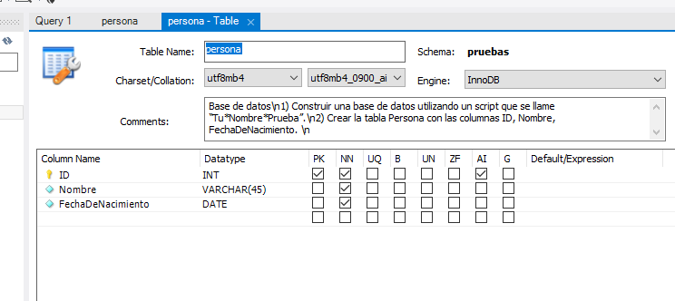

# CRUD-MVC-JAVA
 CRUD DE REGISTRO

# Activities and Intents 

Como parte de nuestro proceso de selección impartimos una asignación de programación con la finalidad de determinar tus competencias para el desarrollo. La prueba se basa en dos puntos, la creación de una base de datos y la creación de una aplicación tipo CRUD.

## Requirements

1.         Base de datos
 
•	Construir una base de datos utilizando un script que se llame “Tu*Nombre*Prueba”.
•	Crear la tabla Persona con las columnas ID, Nombre, FechaDeNacimiento. 
 
2.         Aplicación
 
•	Crear una aplicación que permita conectarse a la base de datos creada en el punto #1. 
•	Puede ser en cualquier tipo de front end (Web, Consola, Desktop, etc.)
•	Debe permitir al usuario ingresar una persona con el input: Nombre, FechaDeNacimiento. 
•	Debe permitir al usuario ver los registros ingresados. 
•	Debe permitir al usuario eliminar cualquiera de los registros.

# Screen Examples:

# INTRO

# RESUMEN

## EDITAR o ACTUALIZAR

## ADD / AGREGAR

## PRUEBA BBDD

## ESTRUCTURA BBDD

### Resources:
Lombok
MySQL
JAVA (JSP)
Bootstrap
CRUD DUMMIE